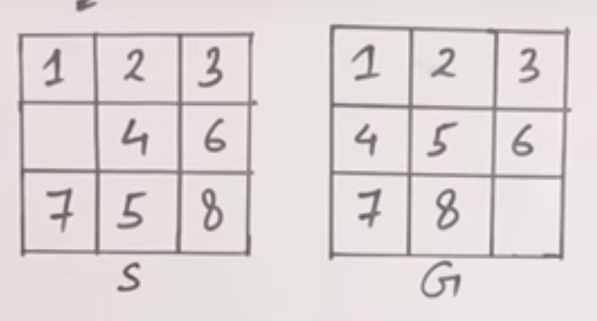

# Searching in AI


### State Space Search
S : {S, A, Action(S), Result(S, a), Cost(S, a)}


### Uninformed Search
- Search without information
- No knowledge
- Time consuming
- more complexity(time, space)
- dfs, bfs

### Informed Searching
- Search with information
- Use knowledge to find steps to solution
- Quick solution
- Less complexity (time, space)
- A*, Heuristic DFS, Best First Search


### Bidirectional Search
- two simultaneous search from an initial node to goal and backward from goal to initial, stopping when - two meet
- time complexity: 2(bd/2)
- complete in breadth first search, not in depth first search
- etc


### 8-Puzzle problem without heuristics
- blind serach (uninformed)
- bfs
- O(b^d^)
- 4moves(up, down, left, right)




### "Heuristic in AI" (Rule of Thumb)
- It is a techinique designed to solve a problem quickly


### 8-Puzzle problem with heuristic


### Generate and Test (Heuristic techinque, DFS with backtracking)
1. Generate a possible solution
2. Test to see if it is a actual solution
3. If a solution is found, quit. Otherwise go to step 1

**Properties of good generators:**
- complete
- non-redundant
- informed


### Best First Search

Informed, Heuristic

**Algorithm**
```pseudocode
Let OPEN be a priority queue containing initial state

LOOP
    if OPEN is empty return failure

    Node <- Remove-First(OPEN)

    if Node is Goal
        then return the path from initial to Node
    else
        generate all successors of Node and put the newly generated Node into OPEN according to their f(heuristic) values
END LOOP
```


### Beam Search Algorithm
- take care of space complexity(constant)
- beam width(&beta;) is given


### Simple Hill Climbing Algorithm
- Local Search Algorithm
- Greedy Approach
- No backtrack

```pseudocode
Evaluate the initial state
Loop until a solution is found or there are no operators left
    Select and Apply a new operator
    Evaluate the new state

    if goal then quit

    if better than current state, then it is the new current state
```


### A* algorithm
Informed Searching

f(N) = g(N) + h(N)
where,
g(N) -> actual cost from start node to N
h(N) -> estimated cost from N to goal node


