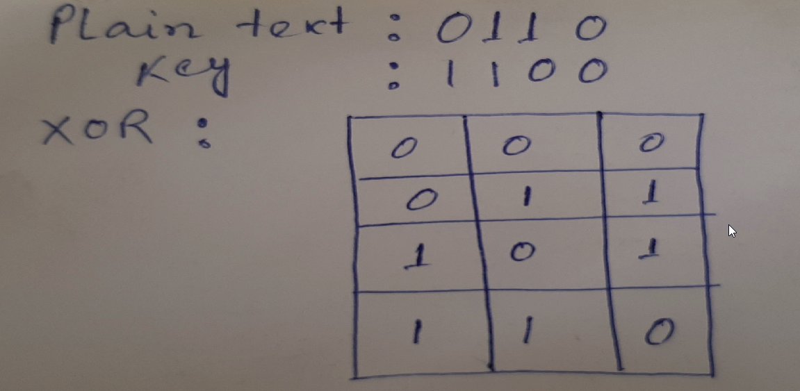
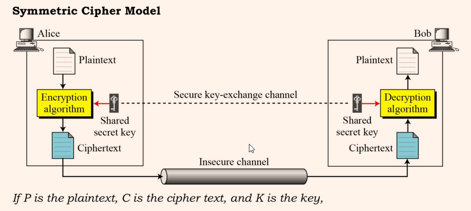

# Network Security
Network Security is any activity designed to protect the usability and integrity of network and data.
- includes both hardware and software technologies
- targets a variety of threats
- stops from entering or spreading on network
- effective network security manage access to network

## Malware Types
- Malware is short form malicious software
- Malware is an umbrella term used to refer to a variety of forms of hostile or 
intrusive software including Ransom wares, Computer Viruses, Worms, 
Trojan Horses, Spyware, Adware, Scareware etc
- can be deployed remotely, tracking the source is hard

### Virus
- contagious program or code that attaches itself to another piece of software, and then reproduces itself when that software is run.

### Worm
- A program that replicates itself and destroys data and files on the computer.
- "eats" the system operating files and data files until drive is empty.

### Trojan
- type of malware that is often disguised as legitimate software.
- written with purpose of discovering financial info, taking over system resources, "DOS attack"

### Ransomware

### Spam
- method of flooding the Internet with copies of the same message
- most "spams" are commercial advertisements

# Cryptography
- can reformat and transform data, making it safer on its trip between computers.
- based on the essentials of secret codes, augmented by mordern mathematics that protects our data in powerful ways.

### Computer Security
- generic name for the collection of tooles designed to protect data and to thwart hackers

### Network Security
- measures to protect data during their transmission

### Internet Security
- measures to protect data during their transmission over a collection of interconnected networks

## Security Attacks, Services and Mechanisms
To assess the security needs of an org effectively, the manager responsible for security needs some systematic way of defining the reqs for security and characterization of approaches to satisfy those reqs. 

### Three aspects of information security:
**Security Attack:** Any action that compromises the security of info owned by an org.
**Security Mechanism:** A mechanism that is designed to detect, prevent or recover from a security attack.
**Security Service:** A service that enhances the security of the data processing systems and the info transfers of an organization.

Network security is protection of the access to files and directories in a computer 
network against hacking, misuse and unauthorized changes to the system.

Ex: The authorization of access to data in a network, which is controlled by the network 
administrator. Users are assigned an ID and password that allows them access to 
information and programs within their authority

## Definitions:
Cryptography
- The art or science encompassing the principles and methods of transforming an intelligible message into one that is unintelligible, and then retransforming that message back to its original form

Plaintext 
- The original intelligible message

Cipher text
- The transformed message

Cipher
- An algorithm for transforming an intelligible message into one that is unintelligible by
 transposition and/or substitution methods

Key
- Some critical information used by the cipher, known only to the sender& receiver

Encipher (encode)
- The process of converting plaintext to cipher text using a cipher and a key

Decipher (decode)
- the process of converting cipher text back into plaintext using a cipher and a key

Cryptanalysis
- The study of principles and methods of transforming an unintelligible message back into an intelligible message without knowledge of the key. Also called code breaking

Cryptology
- Both cryptography and cryptanalysis

Code
- An algorithm for transforming an intelligible message into an unintelligible one using a code-book

Adversary
- An adversary is a subject who tries to gain unauthorized access

Threat
- A threat is a mechanism that the adversary is capable of employing to gain unauthorized access

Risk
- A risk is a loss due to an adversary gaining unauthorized access

Vulnerability
- A vulnerability is a flaw in a that enables a threat to allow the adversary unauthorized access

Threat Model
- A threat model describes all the mechanisms available to the adversaries

Trust Model
- A trust model describes all the subjects that are trusted not to have vulnerabilities that can be abused or be adversaries

Security Model
- A security model consists of a threat model and a trust model ( functional and security goals as well)

Reliability
- property ofa system that indicates it will continue to function for long periods of time under varying circumstances

Survivability
- ability of a system to maintain function during abnormal or environmentally troubling events

Privacy
- the ability to stop information from becoming known to people other than those they choose to give the information

Assurance
- confidence that system meets its security requirements

### Computer Security
The protection afforded to an automated information system in order to attain the applicable objectives of preserving objectives of preserving the **integrity**, **availability** and **confidentiality** of information system resources.

### Security Services
1. Authentication
   - assurance that the communicating entity is the one claimed

2. Access Control
   - prevention of the unauthorized disclosure

3. Data Confidentiality
   - protection of data from unauthorized disclosure

4. Data Integrity
   - assurance that data received is as sent by an authorized entity

5. Non-Repudiation
    - protection against denial by one of the parties in a communication

### Classify Security Attacks

Passive Attacks
- eavesdropping on, or monitoring of, transmissions to:
    - obtain message contents, or,
    - monitor traffic flows

Active Attacks
- modification of data stream to:
    - masquerade of one entity as some other
    - replay previous messages
    - modify messages in transit
    - denial of service

### Symmetric Cipher
- uses the same key for encryption and decryption.
- use the same key(called a secret key, or, private key) for transforming the original message (called plaintext) into ciphertext and vice versa.
- generally faster than asymmetric counterparts, which use a closely-held private key as well as a public key shared between the two parties.

Cryptographic Systems are generally classified along 3 independent dimensions:
1. Type of operations used for transforming plain text to cipher text
  - All the encryption algorithms are based on two general principles: substitution, in which each element in the plaintext is mapped into another element, and transposition, in which elements in the plaintext are rearranged.

2. The number of keys used
  - If the sender and receiver uses same key then it is said to be symmetric key (or)  single key (or) conventional encryption.

3. If the sender and receiver use different keys then it is said to be public key encryption.
  - The way in which the plain text is processed. A block cipher processes the input and block of elements at a time, producing output block for each input block. A stream cipher processes the input elements continuously, producing output element one at a time, as it goes along.

> e.g. Engima Machine was used to secure communication of german military during World War II

### Cryptography
- art (sometimes science) of secret writing
- Cryptographers create ciphers
- Cryptanalyst break ciphers

> The history of cryptography is an arms race between cryptographers and cryptanalysts.

A cryptosystem is a 5-tuple consisting of (E, D, M, K, C) where, 
E = encryption algorithm
D = decryption algorithm
M = set of plaintexts
K = set of keys
C = set of ciphertexts

E: M*K -> C,   D: C*K -> M

### Substitution Ciphers
- A substitution cipher replaces one symbol with another.
- Substitution ciphers can be categorized as either mono-alphabetic ciphers, or, polyalphabetic ciphers.

### Monoalphabetic Substitution Cipher
Page 13-17 of Lecture 2

